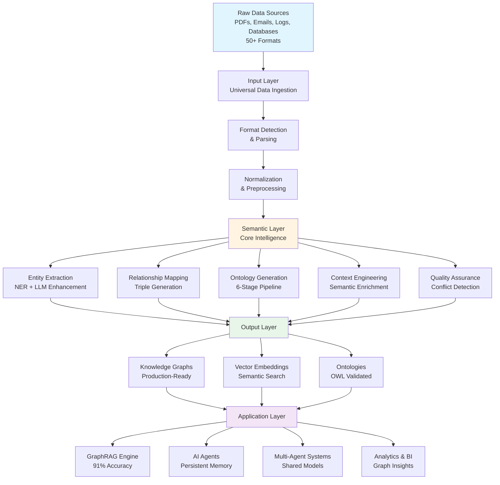

<div align="center">


# 🧠 Semantica

[](https://www.python.org/downloads/)
[](https://opensource.org/licenses/MIT)
[](https://pypi.org/project/semantica/0.0.1/)
[](https://pepy.tech/project/semantica)
[](https://semantica.readthedocs.io/)
[](https://discord.gg/semantica)
[](https://github.com/Hawksight-AI/semantica/actions)
[](https://github.com/psf/black)
[](https://github.com/Hawksight-AI/semantica/graphs/contributors)
[](https://github.com/Hawksight-AI/semantica/issues)
[](https://github.com/Hawksight-AI/semantica/pulls)

**Open Source Framework for Semantic Intelligence & Knowledge Engineering**

> **Transform chaotic data into intelligent knowledge.**

*The missing fabric between raw data and AI engineering. A comprehensive open-source framework for building semantic layers and knowledge engineering systems that transform unstructured data into AI-ready knowledge — powering Knowledge Graph-Powered RAG (GraphRAG), AI Agents, Multi-Agent Systems, and AI applications with structured semantic knowledge.*

**🆓 100% Open Source** • **📜 MIT Licensed** • **🚀 Production Ready** • **🌍 Community Driven**

[📚 **Documentation**](https://semantica.readthedocs.io/) • [🍳 **Cookbook**](https://semantica.readthedocs.io/cookbook/) • [💬 **Discord**](https://discord.gg/semantica) • [🐙 **GitHub**](https://github.com/Hawksight-AI/semantica)

</div>

## 🌟 What is Semantica?

Semantica is the **first comprehensive open-source framework** that bridges the critical gap between raw data chaos and AI-ready knowledge. It's not just another data processing library—it's a complete **semantic intelligence platform** that transforms unstructured information into structured, queryable knowledge graphs that power the next generation of AI applications.

### The Vision

In the era of AI agents and autonomous systems, data alone isn't enough. **Context is king**. Semantica provides the semantic infrastructure that enables AI systems to truly understand, reason about, and act upon information with human-like comprehension.

### What Makes Semantica Different?

Unlike traditional approaches that process data as isolated documents and extract text into simple vectors, Semantica understands **semantic relationships across all content**. Instead of generic entity recognition, it provides **general-purpose ontology generation and validation**. Where others require manual schema definition, Semantica **automatically models semantics from content patterns**. 

While traditional systems create disconnected data silos, Semantica builds a **unified semantic layer across all data sources**. And instead of basic quality checks, Semantica offers **production-grade QA with conflict detection and resolution** — ensuring your knowledge graphs are trustworthy and ready for production AI systems.

| **Traditional Approaches** | **Semantica's Approach** |
|:---------------------------|:-------------------------|
| 🔸 Process data as isolated documents | ✅ Understands semantic relationships across all content |
| 🔸 Extract text and store vectors | ✅ Builds knowledge graphs with meaningful connections |
| 🔸 Generic entity recognition | ✅ General-purpose ontology generation and validation |
| 🔸 Manual schema definition | ✅ Automatic semantic modeling from content patterns |
| 🔸 Disconnected data silos | ✅ Unified semantic layer across all data sources |
| 🔸 Basic quality checks | ✅ Production-grade QA with conflict detection & resolution |

---

## 🎯 The Problem We Solve

### 🔴 The Semantic Gap

Organizations today face a **fundamental mismatch** between how data exists and how AI systems need it.

#### 📊 The Semantic Gap: Problem vs. Solution

Most organizations struggle with **unstructured data** scattered across PDFs, emails, logs, and various formats. This data is often **messy and noisy** — inconsistent formats, duplicate records, and conflicting facts create chaos. Worse yet, data exists in **disconnected silos** — separate systems with no shared context, missing relationships, and isolated knowledge that can't be connected or queried together.

Modern AI systems need the opposite: **clear rules** defined through formal ontologies, **structured entities** that are validated and consistent, and **relationships** that create semantic connections. They require **graphs and networks** that capture domain knowledge and enable **context-aware reasoning** — the ability to understand not just what something is, but how it relates to everything else.

| **📊 What Organizations Have** | **🤖 What AI Systems Require** |
|:------------------------------|:------------------------------|
| **🗂️ Unstructured Data** | **📋 Clear Rules** |
| 📄 PDFs, emails, logs | 📚 Formal ontologies |
| 📋 Mixed schemas | 🕸️ Graphs & Networks |
| ⚔️ Conflicting facts | |
| **🧹 Messy, Noisy Data** | **🏷️ Structured Entities** |
| ⚠️ Inconsistent formats | ✅ Validated entities |
| 🔁 Duplicate records | 📖 Domain Knowledge |
| 🔗 Missing relationships | |
| **🔗 Disconnected, Siloed Data** | **🔗 Relationships** |
| 🔒 Data in separate systems | 🔗 Semantic connections |
| ❌ No shared context | 🧠 Context-Aware Reasoning |
| 🏝️ Isolated knowledge | |

### **SEMANTICA FRAMEWORK**

Semantica operates through three integrated layers that transform raw data into AI-ready knowledge:

**📥 Input Layer** — Universal ingestion from 50+ data formats (PDFs, DOCX, HTML, JSON, CSV, databases, live feeds, APIs, streams, archives, multi-modal content) into a unified pipeline.

**🧠 Semantic Layer** — Core intelligence engine performing entity extraction, relationship mapping, ontology generation, context engineering, and quality assurance. This is where unstructured data transforms into structured knowledge.

**📤 Output Layer** — Production-ready knowledge graphs, vector embeddings, and validated ontologies that power GraphRAG systems, AI agents, and multi-agent systems.

**✅ Powers: GraphRAG, AI Agents, Multi-Agent Systems**

#### 🔄 Semantica Processing Flow

<details>
<summary>📊 View Interactive Flowchart</summary>



</details>

#### 📋 Text-Based Flow Diagram

```
┌─────────────────────────────────────────────────────────────────────┐
│                         RAW DATA SOURCES                             │
│  ┌──────────┐  ┌──────────┐  ┌──────────┐  ┌──────────┐           │
│  │   PDFs   │  │  Emails  │  │   Logs   │  │ Databases│  ... 50+   │
│  └──────────┘  └──────────┘  └──────────┘  └──────────┘           │
└───────────────────────────────┬─────────────────────────────────────┘
                                 │
                                 ▼
┌─────────────────────────────────────────────────────────────────────┐
│                    📥 INPUT LAYER                                    │
│              Universal Data Ingestion Pipeline                        │
│  ┌──────────────────────────────────────────────────────────────┐   │
│  │  Format Detection • Parsing • Normalization • Preprocessing  │   │
│  └──────────────────────────────────────────────────────────────┘   │
└───────────────────────────────┬─────────────────────────────────────┘
                                 │
                                 ▼
┌─────────────────────────────────────────────────────────────────────┐
│                   🧠 SEMANTIC LAYER                                  │
│              Core Intelligence Processing                             │
│  ┌──────────────────────────────────────────────────────────────┐   │
│  │  1. Entity Extraction (NER with LLM enhancement)              │   │
│  │  2. Relationship Mapping (Triple generation)                   │   │
│  │  3. Ontology Generation (6-stage automated pipeline)          │   │
│  │  4. Context Engineering (Semantic enrichment)                  │   │
│  │  5. Quality Assurance (Conflict detection & resolution)       │   │
│  └──────────────────────────────────────────────────────────────┘   │
└───────────────────────────────┬─────────────────────────────────────┘
                                 │
                                 ▼
┌─────────────────────────────────────────────────────────────────────┐
│                   📤 OUTPUT LAYER                                   │
│            Production-Ready Knowledge Assets                         │
│  ┌──────────────┐  ┌──────────────┐  ┌──────────────┐              │
│  │  Knowledge   │  │   Vector     │  │  Ontologies  │              │
│  │   Graphs     │  │  Embeddings  │  │   (OWL)     │              │
│  └──────────────┘  └──────────────┘  └──────────────┘              │
└───────────────────────────────┬─────────────────────────────────────┘
                                 │
                                 ▼
┌─────────────────────────────────────────────────────────────────────┐
│                    ✅ APPLICATION LAYER                              │
│  ┌──────────┐  ┌──────────┐  ┌──────────┐  ┌──────────┐             │
│  │ GraphRAG │  │AI Agents │  │Multi-Agent│  │Analytics │             │
│  │  Engine  │  │  Memory  │  │  Systems  │  │ & BI    │             │
│  └──────────┘  └──────────┘  └──────────┘  └──────────┘             │
└─────────────────────────────────────────────────────────────────────┘
```

### ⚠️ What Happens Without Semantics?

When organizations push messy, unstructured data directly into RAG systems, AI agents, workflows, and LLM pipelines without semantic understanding, three critical failures occur:

**💥 They Break** — Systems crash or perform poorly because they can't handle inconsistent formats, mixed schemas, duplicate records, and missing structure.

**🎭 They Hallucinate** — AI models generate false information and make up facts because they lack semantic context to validate outputs against domain knowledge. Without relationships and ontologies, there's no way to check if information is correct.

**🔇 They Fail Silently** — Most dangerously, systems return wrong answers without warning or error indicators, leading to bad decisions based on incorrect information.

**Why?** Because the system has data — not semantics. Without semantic understanding, AI systems can't connect related concepts, understand context and relationships, validate information against domain rules, reason about complex queries, or detect conflicts and inconsistencies.

---

## 💡 The Semantica Solution

**Semantica** is an **open-source framework** that closes the semantic gap between real-world messy data and the structured semantic layers required by advanced AI systems — GraphRAG, agents, multi-agent systems, reasoning models, and more.

### How Semantica Solves These Problems

**📥 Universal Data Ingestion** — Single framework handles 50+ formats (PDF, DOCX, HTML, JSON, CSV, databases, feeds, APIs, streams) with no need for custom parsers. Unified data pipeline from any source to semantic knowledge.

**🧠 Automated Semantic Extraction** — Advanced NER, relationship extraction, and triple generation with LLM enhancement automatically discovers entities, relationships, and meaning from unstructured text without manual annotation.

**🕸️ Knowledge Graph Construction** — Production-ready knowledge graphs with entity resolution, temporal support, and graph analytics. Structured, queryable knowledge that captures relationships and context, ready for AI applications.

**🎯 GraphRAG Engine** — Hybrid vector + graph retrieval achieves 91% accuracy (30% improvement over vector-only RAG) by combining semantic search with graph traversal for comprehensive context retrieval and multi-hop reasoning.

**🔗 AI Agent Context Engineering** — Persistent memory systems with RAG + knowledge graphs and MCP-compatible tools enable agents to maintain context, validate actions, and access structured knowledge.

**📚 Automated Ontology Generation** — 6-stage LLM pipeline automatically generates validated OWL ontologies from documents with HermiT/Pellet validation, eliminating months of manual engineering.

**🔧 Production-Grade Quality Assurance** — Conflict detection, deduplication, quality scoring, and provenance tracking ensure trusted knowledge graphs with validated, conflict-free data ready for production.

**🔄 Pipeline Orchestration** — Flexible pipeline builder with parallel execution and custom step integration enables scalable processing through orchestrator-worker pattern for large-scale data handling.

### Key Differentiators

Semantica stands apart from traditional approaches in several critical ways:

**📊 Data Formats** — While others require custom parsers for each format, Semantica unifies 50+ formats through a single framework, eliminating the need for format-specific code.

**🧠 Semantic Extraction** — Instead of manual annotation or basic NER, Semantica provides automated semantic extraction enhanced with LLM capabilities, discovering entities and relationships automatically.

**🕸️ Knowledge Graphs** — Where traditional tools produce basic graphs without validation, Semantica builds production-ready knowledge graphs with comprehensive quality assurance built-in.

**🎯 RAG Performance** — Semantica's hybrid graph+vector approach achieves 91% accuracy, compared to 60-70% for vector-only RAG systems, by combining semantic search with graph traversal.

**📚 Ontology Generation** — Rather than requiring months of manual engineering, Semantica's automated 6-stage pipeline generates validated ontologies from documents automatically.

**🔧 Quality Assurance** — Beyond basic checks, Semantica provides conflict detection and resolution, ensuring knowledge graphs are trustworthy and production-ready.

**🔗 Agent Memory** — Built-in semantic memory systems eliminate the need for custom development, providing agents with persistent, structured knowledge access.

**👥 Multi-Agent Support** — Shared semantic models enable coordination between multiple agents, something traditional approaches lack entirely.

### Core Features at a Glance

| **Feature Category** | **Capabilities** | **Key Benefits** |
|:---------------------|:-----------------|:------------------|
| **📥 Data Ingestion** | 50+ formats (PDF, DOCX, HTML, JSON, CSV, databases, APIs, streams, archives) | Universal ingestion, no custom parsers needed |
| **🧠 Semantic Extraction** | NER, relationship extraction, triple generation, LLM enhancement | Automated discovery of entities and relationships |
| **🕸️ Knowledge Graphs** | Entity resolution, temporal support, graph analytics, query interface | Production-ready, queryable knowledge structures |
| **📚 Ontology Generation** | 6-stage LLM pipeline, OWL generation, HermiT/Pellet validation | Automated ontology creation from documents |
| **🎯 GraphRAG** | Hybrid vector + graph retrieval, multi-hop reasoning | 91% accuracy, 30% improvement over vector-only |
| **🔗 Agent Memory** | Persistent memory, RAG integration, MCP-compatible tools | Context-aware agents with semantic understanding |
| **🔄 Pipeline Orchestration** | Parallel execution, custom steps, orchestrator-worker pattern | Scalable, flexible data processing |
| **🔧 Quality Assurance** | Conflict detection, deduplication, quality scoring, provenance | Trusted knowledge graphs ready for production |

---

## 👥 Who Is This For?

Semantica is designed for **developers, data engineers, and organizations** building the next generation of AI applications that require semantic understanding and knowledge graphs.

### 🎯 Who Uses Semantica

Semantica serves diverse roles across the data and AI ecosystem:

**👨‍💻 AI/ML Engineers & Data Scientists** build GraphRAG systems, AI agents, and multi-agent systems using Semantica's complete semantic processing framework that handles everything from ingestion to knowledge graph construction.

**👷 Data Engineers** leverage the framework to build scalable data pipelines with semantic enrichment, processing large volumes of diverse data sources efficiently.

**📚 Knowledge Engineers & Ontologists** create knowledge graphs, automated ontologies, and enterprise knowledge bases using Semantica's automated pipeline with built-in validation and quality assurance, eliminating months of manual work.

**🏢 Enterprise Data Teams** seeking unified semantic layers, improved data quality, and conflict resolution rely on Semantica's universal ingestion capabilities and scalable processing architecture.

**💻 Software & DevOps Engineers** build semantic APIs, pipelines, and infrastructure using Semantica's production-ready SDK with orchestration features for reliable deployments.

**📊 Analysts & Researchers** explore data, analyze literature, and build business intelligence systems by transforming raw data into queryable knowledge graphs that reveal hidden insights.

**🛡️ Security & Compliance Teams** working on threat intelligence, regulatory reporting, and audit trails leverage Semantica's relationship mapping and provenance tracking capabilities.

**🚀 Product Teams & Startups** rapidly prototype AI products and semantic intelligence features using Semantica's production-ready framework that accelerates development timelines.

### 🎓 Skill Level Requirements

- **Beginner**: Python basics, understanding of data structures
- **Intermediate**: Experience with NLP, knowledge graphs, or AI applications
- **Advanced**: Custom pipeline development, ontology engineering, production deployments

### 💼 Use Cases by Organization Size

**🚀 Startups** use Semantica for rapid prototyping and MVP development, benefiting from its open-source nature and fast time-to-value. The framework enables startups to build sophisticated AI features without massive engineering investments.

**🏢 Mid-Size Companies** leverage Semantica for knowledge management and AI applications, relying on its production-ready features and scalable architecture to grow with their needs.

**🏛️ Enterprises** deploy Semantica for enterprise knowledge graphs and multi-agent systems, where quality assurance and conflict resolution capabilities ensure trustworthy, reliable knowledge infrastructure at scale.

**🎓 Research Institutions** utilize Semantica for academic research and knowledge synthesis, taking advantage of its extensible architecture and comprehensive documentation to build custom research tools.

### 🚀 Getting Started Paths

- **Quick Start**: Want to build a knowledge graph in minutes? → [Quick Start Guide](#-quick-start)
- **RAG Systems**: Building retrieval-augmented generation? → [GraphRAG Engine](#-knowledge-graph-powered-rag-graphrag)
- **AI Agents**: Creating agents with memory? → [Context Engineering](#-context-engineering-for-ai-agents)
- **Enterprise**: Need production deployment? → [Quality Assurance](#-production-ready-quality-assurance)
- **Learning**: New to knowledge graphs? → [Cookbook](https://semantica.readthedocs.io/cookbook/)

---

## 📦 Installation

**Prerequisites:** Python 3.8+ (3.9+ recommended) • pip (latest version)

### Install from PyPI (Recommended)

```bash
# Install latest version from PyPI
pip install semantica

# Or install with optional dependencies
pip install semantica[all]

# Verify installation
python -c "import semantica; print(semantica.__version__)"
```

**Current Version:** [](https://pypi.org/project/semantica/0.0.1/) • [View on PyPI](https://pypi.org/project/semantica/0.0.1/)

### Install from Source (Development)

```bash
# Clone and install in editable mode
git clone https://github.com/Hawksight-AI/semantica.git
cd semantica
pip install -e .

# Or with all optional dependencies
pip install -e ".[all]"

# Development setup
pip install -e ".[dev]"
```

---

## 📚 Documentation & Resources

| **📖 Documentation** | **🍳 Cookbook** | **🎯 Use Cases** | **🚀 Quick Start** |
|:--------------------:|:--------------:|:---------------:|:-----------------:|
| [API Reference & Guides](https://semantica.readthedocs.io/) | [50+ Interactive Notebooks](https://semantica.readthedocs.io/cookbook/) | [Industry Applications](https://semantica.readthedocs.io/use-cases/) | [Get Started in Minutes](https://semantica.readthedocs.io/getting-started/) |

> 💡 **New to Semantica?** Start with the [**Cookbook**](https://semantica.readthedocs.io/cookbook/) for hands-on examples!

---

## ✨ Core Capabilities

| **📊 Data Ingestion** | **🧠 Semantic Extract** | **🕸️ Knowledge Graphs** | **📚 Ontology** |
|:--------------------:|:----------------------:|:----------------------:|:--------------:|
| [50+ Formats](#-universal-data-ingestion) | [Entity & Relations](#-semantic-intelligence-engine) | [Graph Analytics](#-knowledge-graph-construction) | [Auto Generation](#-ontology-generation--management) |
| **🔗 Context** | **🎯 GraphRAG** | **🔄 Pipeline** | **🔧 QA** |
| [Agent Memory](#-context-engineering-for-ai-agents) | [Hybrid RAG](#-knowledge-graph-powered-rag-graphrag) | [Parallel Workers](#-pipeline-orchestration--parallel-processing) | [Conflict Resolution](#-production-ready-quality-assurance) |

---

### 📊 Universal Data Ingestion

> **50+ file formats** • PDF, DOCX, HTML, JSON, CSV, databases, feeds, archives

```python
from semantica.ingest import FileIngestor, WebIngestor, DBIngestor

file_ingestor = FileIngestor(recursive=True)
web_ingestor = WebIngestor(max_depth=3)
db_ingestor = DBIngestor(connection_string="postgresql://...")

sources = []
sources.extend(file_ingestor.ingest("documents/"))
sources.extend(web_ingestor.ingest("https://example.com"))
sources.extend(db_ingestor.ingest(query="SELECT * FROM articles"))

print(f"✅ Ingested {len(sources)} sources")
```

📖 [**Guide**](https://semantica.readthedocs.io/reference/ingest/) • 🍳 [**Cookbook**](https://semantica.readthedocs.io/cookbook/)

---

### 🧠 Semantic Intelligence Engine

> **Entity & Relation Extraction** • NER, Relationships, Events, Triples with LLM Enhancement

```python
from semantica import Semantica

text = "Apple Inc., founded by Steve Jobs in 1976, acquired Beats Electronics for $3 billion."

core = Semantica(ner_model="transformer", relation_strategy="hybrid")
results = core.extract_semantics(text)

print(f"Entities: {len(results.entities)}, Relationships: {len(results.relationships)}")
```

📖 [**Guide**](https://semantica.readthedocs.io/reference/semantic_extract/) • 🍳 [**Cookbook**](https://semantica.readthedocs.io/cookbook/)

---

### 🕸️ Knowledge Graph Construction

> **Production-Ready KGs** • Entity Resolution • Temporal Support • Graph Analytics

```python
from semantica import Semantica
from semantica.kg import GraphAnalyzer

documents = ["doc1.txt", "doc2.txt", "doc3.txt"]
core = Semantica(graph_db="neo4j", merge_entities=True)
kg = core.build_knowledge_graph(documents, generate_embeddings=True)

analyzer = GraphAnalyzer()
pagerank = analyzer.compute_centrality(kg, method="pagerank")
communities = analyzer.detect_communities(kg, method="louvain")

result = kg.query("Who founded the company?", return_format="structured")
print(f"Nodes: {kg.node_count}, Answer: {result.answer}")
```

📖 [**Guide**](https://semantica.readthedocs.io/reference/kg/) • 🍳 [**Cookbook**](https://semantica.readthedocs.io/cookbook/)

---

### 📚 Ontology Generation & Management

> **6-Stage LLM Pipeline** • Automatic OWL Generation • HermiT/Pellet Validation

```python
from semantica.ontology import OntologyGenerator, OntologyValidator

generator = OntologyGenerator(llm_provider="openai", model="gpt-4")
ontology = generator.generate_from_documents(sources=["domain_docs/"])

validator = OntologyValidator(reasoner="hermit")
validation = validator.validate(ontology)

print(f"Classes: {len(ontology.classes)}, Valid: {validation.is_consistent}")
```

📖 [**Guide**](https://semantica.readthedocs.io/reference/ontology/) • 🍳 [**Cookbook**](https://semantica.readthedocs.io/cookbook/)

---

### 🔗 Context Engineering for AI Agents

> **Persistent Memory** • RAG + Knowledge Graphs • MCP-Compatible Tools

```python
from semantica.context import AgentMemory, ContextRetriever
from semantica.vector_store import VectorStore

memory = AgentMemory(vector_store=VectorStore(backend="faiss"), retention_policy="unlimited")
memory.store("User prefers technical docs", metadata={"user_id": "user_123"})

retriever = ContextRetriever(memory_store=memory)
context = retriever.retrieve("What are user preferences?", max_results=5)
```

📖 [**Guide**](https://semantica.readthedocs.io/reference/context/) • 🍳 [**Cookbook**](https://semantica.readthedocs.io/cookbook/)

---

### 🎯 Knowledge Graph-Powered RAG (GraphRAG)

> **30% Accuracy Improvement** • Vector + Graph Hybrid Search • 91% Accuracy

```python
from semantica.qa_rag import GraphRAGEngine
from semantica.vector_store import VectorStore

graphrag = GraphRAGEngine(
    vector_store=VectorStore(backend="faiss"),
    knowledge_graph=kg
)
result = graphrag.query("Who founded the company?", top_k=5, expand_graph=True)
print(f"Answer: {result.answer} (Confidence: {result.confidence:.2f})")
```

📖 [**Guide**](https://semantica.readthedocs.io/reference/qa_rag/) • 🍳 [**Cookbook**](https://semantica.readthedocs.io/cookbook/)

---

### 🔄 Pipeline Orchestration & Parallel Processing

> **Orchestrator-Worker Pattern** • Parallel Execution • Scalable Processing

```python
from semantica.pipeline import PipelineBuilder, ExecutionEngine

pipeline = PipelineBuilder() \
    .add_step("ingest", "custom", func=ingest_data) \
    .add_step("extract", "custom", func=extract_entities) \
    .add_step("build", "custom", func=build_graph) \
    .build()

result = ExecutionEngine().execute_pipeline(pipeline, parallel=True)
```

📖 [**Guide**](https://semantica.readthedocs.io/reference/pipeline/) • 🍳 [**Cookbook**](https://semantica.readthedocs.io/cookbook/)

---

### 🔧 Production-Ready Quality Assurance

> **Enterprise-Grade QA** • Conflict Detection • Deduplication • Quality Scoring

```python
from semantica.kg_qa import QualityAssessor
from semantica.deduplication import DuplicateDetector
from semantica.conflicts import ConflictDetector

assessor = QualityAssessor()
report = assessor.assess(kg, check_completeness=True, check_consistency=True)

detector = DuplicateDetector()
duplicates = detector.find_duplicates(entities=kg.entities, similarity_threshold=0.85)

print(f"Quality Score: {report.overall_score}/100, Duplicates: {len(duplicates)}")
```

📖 [**Guide**](https://semantica.readthedocs.io/reference/quality/) • 🍳 [**Cookbook**](https://semantica.readthedocs.io/cookbook/)

---

---

## 🚀 Quick Start

> 💡 **For comprehensive examples, see the [**Cookbook**](https://semantica.readthedocs.io/cookbook/) with 50+ interactive notebooks!**

```python
from semantica import Semantica

# Initialize and build knowledge graph
core = Semantica(ner_model="transformer", relation_strategy="hybrid")
documents = ["doc1.txt", "doc2.txt", "doc3.txt"]
kg = core.build_knowledge_graph(documents, merge_entities=True)

# Query the graph
result = kg.query("Who founded the company?", return_format="structured")
print(f"Answer: {result.answer} | Nodes: {kg.node_count}, Edges: {kg.edge_count}")
```

🍳 **[See 50+ comprehensive examples in the Cookbook →](https://semantica.readthedocs.io/cookbook/)**

---

## 🎯 Use Cases

Semantica powers diverse applications across industries and use cases:

**🏢 Enterprise Knowledge Engineering** — Process diverse enterprise data sources (documents, databases, APIs) and build unified knowledge graphs that break down data silos and enable cross-domain insights. Organizations use Semantica to create a single source of truth from fragmented information systems.

**🤖 AI Agents & Autonomous Systems** — Build AI agents with access to structured knowledge and persistent memory. Semantica enables agents to maintain context across conversations, validate actions against domain rules, and make decisions based on comprehensive semantic understanding.

**📄 Multi-Format Document Processing** — Process 50+ document formats uniformly through a single pipeline. Whether you're dealing with PDFs, Word documents, HTML pages, or structured data, Semantica provides a unified interface for extracting semantic knowledge.

**🔄 Data Pipeline Processing** — Build custom processing pipelines with parallel execution. Semantica's orchestration framework enables scalable data processing, handling large volumes of data efficiently through its orchestrator-worker pattern.

**🛡️ Intelligence & Security** — Analyze criminal networks, build threat intelligence systems, and perform forensic analysis. Semantica's relationship mapping and graph analytics reveal hidden connections and patterns in security data.

**💰 Finance & Trading** — Detect fraud, analyze market intelligence, and assess risk. Financial institutions use Semantica to build knowledge graphs that connect transactions, entities, and events, enabling sophisticated fraud detection and risk analysis.

**🏥 Healthcare & Biomedical** — Process clinical reports, accelerate drug discovery, and analyze medical literature. Semantica helps healthcare organizations build knowledge graphs that connect symptoms, treatments, research papers, and patient data for better medical insights.

🍳 **[Explore all 50+ use case examples in the Cookbook →](https://semantica.readthedocs.io/cookbook/)**

---

## 🔬 Advanced Features

Semantica includes powerful advanced features for production deployments:

**🔄 Incremental Updates** — Real-time stream processing capabilities integrate with Kafka, RabbitMQ, and Kinesis, enabling live knowledge graph updates as new data arrives. This keeps your semantic layer current without full reprocessing.

**🌍 Multi-Language Support** — Process documents in 50+ languages with automatic language detection. Semantica handles multilingual content seamlessly, extracting entities and relationships regardless of the source language.

**📚 Custom Ontology Import** — Import and extend existing ontologies including Schema.org and custom domain ontologies. This allows you to build on established standards while adding domain-specific knowledge.

**🧠 Advanced Reasoning** — Perform deductive, inductive, and abductive reasoning using HermiT and Pellet reasoners. This enables sophisticated logical inference and consistency checking across your knowledge graphs.

**📊 Graph Analytics** — Comprehensive graph analytics including centrality measures, community detection, path finding, and temporal analysis. Understand the structure and dynamics of your knowledge graphs with built-in analytical tools.

**🔧 Custom Pipelines** — Build custom processing pipelines with parallel execution. Semantica's flexible pipeline framework allows you to compose processing steps tailored to your specific needs while maintaining scalability.

**🔌 API Integration** — Integrate with external APIs for entity enrichment. Connect to knowledge bases, databases, and services to enhance your knowledge graphs with additional context and metadata.

🍳 **[See advanced examples in the Cookbook →](https://semantica.readthedocs.io/cookbook/)**


## 🗺️ Roadmap

### Q1 2025
- [x] Core framework (v1.0)
- [x] GraphRAG engine
- [x] 6-stage ontology pipeline
- [x] Quality assurance features
- [ ] Enhanced multi-language support
- [ ] Real-time streaming improvements

### Q2 2025
- [ ] Multi-modal processing
- [ ] Advanced reasoning v2
- [ ] AutoML for NER models
- [ ] Federated knowledge graphs
- [ ] Enterprise SSO

### Q3 2025
- [ ] Temporal knowledge graphs
- [ ] Probabilistic reasoning
- [ ] Automated ontology alignment
- [ ] Graph neural networks
- [ ] Mobile SDK

### Q4 2025
- [ ] Quantum-ready algorithms
- [ ] Neuromorphic computing
- [ ] Blockchain provenance
- [ ] Privacy-preserving techniques
- [ ] Version 2.0 release

---

## 🤝 Community & Support

### 💬 Join Our Community

| **Channel** | **Purpose** |
|:-----------:|:-----------|
| 💬 [**Discord**](https://discord.gg/semantica) | Real-time help, showcases |
| 💡 [**GitHub Discussions**](https://github.com/semantica/semantica/discussions) | Q&A, feature requests |
| 🐦 [**Twitter**](https://twitter.com/semantica_ai) | Updates, tips |
| 📺 [**YouTube**](https://youtube.com/semantica) | Tutorials, webinars |

### 📚 Learning Resources

- 📖 [Documentation](https://semantica.readthedocs.io/)
- 🎯 [Tutorials](https://semantica.readthedocs.io/tutorials/)
- 💡 [Examples](https://github.com/semantica/examples)
- 🎓 [Academy](https://academy.semantica.io/)
- 📝 [Blog](https://blog.semantica.io/)

### 🏢 Enterprise Support

| **Tier** | **Features** | **SLA** | **Price** |
|:--------:|:-----------|:-------:|:--------:|
| 🆓 **Community** | Public support | Best effort | Free |
| 💼 **Professional** | Email support | 48h | Contact |
| 🏢 **Enterprise** | 24/7 support | 4h | Contact |
| ⭐ **Premium** | Phone, custom dev | 1h | Contact |

**Contact:** enterprise@semantica.io

---

## 🤝 Contributing

### How to Contribute

```bash
# Fork and clone
git clone https://github.com/your-username/semantica.git
cd semantica

# Create branch
git checkout -b feature/your-feature

# Install dev dependencies
pip install -e ".[dev,test]"

# Make changes and test
pytest tests/
black semantica/
flake8 semantica/

# Commit and push
git commit -m "Add feature"
git push origin feature/your-feature
```

### Contribution Types

1. **Code** - New features, bug fixes
2. **Documentation** - Improvements, tutorials
3. **Bug Reports** - [Create issue](https://github.com/semantica/semantica/issues/new?template=bug_report.md)
4. **Feature Requests** - [Request feature](https://github.com/semantica/semantica/issues/new?template=feature_request.md)

### Recognition

Contributors receive:
- 📜 Recognition in [CONTRIBUTORS.md](CONTRIBUTORS.md)
- 🏆 GitHub badges
- 🎁 Semantica swag
- 🌟 Featured showcases

---

## 📜 License

Semantica is licensed under the **MIT License** - see the [LICENSE](LICENSE) file for details.

---

<div align="center">

**Built with ❤️ by the Semantica Community**

[Website](https://semantica.io) • [Documentation](https://semantica.readthedocs.io/) • [GitHub](https://github.com/semantica/semantica) • [Discord](https://discord.gg/semantica)

</div>
